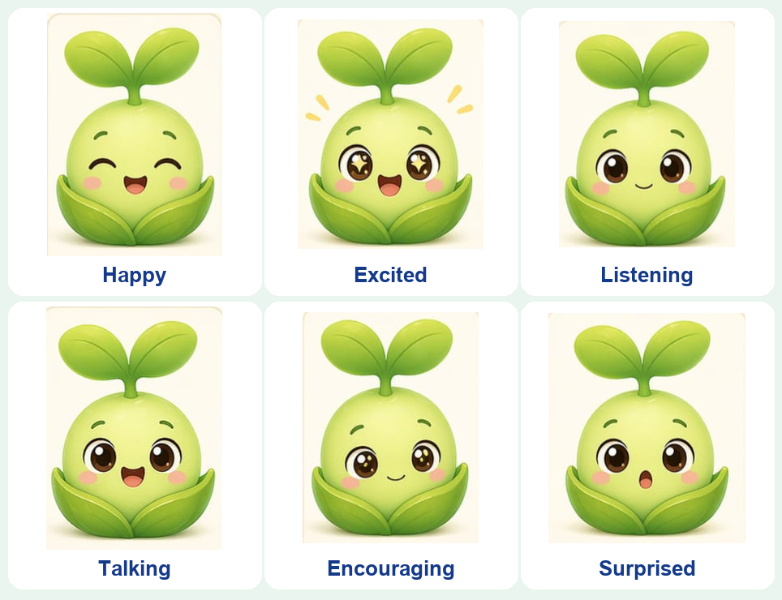

# 🌱 Al-Faseelah — Animated Character Display

> The on-screen animated face of **Al-Faseelah**, the friendly plant character from **Al-Faseelah World** — an AI-powered educational toy for children aged 4–9. This module renders Al-Faseelah's expressions, talking, and blinking on a Raspberry Pi screen, driven by a simple API.

<p align="center">
  
  
  
  
</p>

<p align="center">
  
</p>

---

## ℹ️ About This Repository

This is the **character-display (front-facing) part** of **Al-Faseelah World**, a graduation project (Computer Engineering). It is the animated face the child sees and talks to.

- **This module was designed and built by [Fatima Azazmah](https://github.com/FatimaAzazmah)** on her own.
- It is **one part of a larger joint graduation project** created together with **Rawaa Hammad**. The shared AI/dialogue layer and the hardware/sensor work are part of that joint project.
- The parent companion app (**Pearant**), also built by Fatima, lives here:
  👉 [Parent App — Al-Faseelah World](https://github.com/FatimaAzazmah/Parent_App_Al-Faseelah_World_Graduation_Project)

This repository contains **only the character-display component** so it can be showcased and reused on its own.

---

## 📑 Table of Contents

- [Overview](#-overview)
- [Features](#-features)
- [How It Works](#-how-it-works)
- [Public API](#-public-api)
- [Installation](#-installation)
- [Usage](#-usage)
- [Controls](#-controls)
- [Project Structure](#-project-structure)
- [Where It Fits](#-where-it-fits)
- [Author](#-author)

---

## 🔎 Overview

Al-Faseelah is a small plant character that reacts to a child during play: she greets, talks, listens, encourages, and shows emotions. This module is the **real-time animation engine** behind that face. It runs full-screen on a Raspberry Pi (800×480) using **Pygame**, and exposes a tiny API so the AI/dialogue layer can drive expressions and speech in real time.

---

## ✨ Features

- 🎭 **12 expressions** — neutral, happy, excited, surprised, sad, sleeping, encouraging, listening, and more.
- 💬 **Talking animation** — mouth frames alternate while audio plays.
- 👀 **Automatic + manual blinking** for a lifelike feel.
- 🌫️ **Smooth crossfade** transitions between expressions.
- ✂️ **Automatic background removal** (edge-seeded flood fill) so hand-drawn frames sit cleanly on any background.
- 📐 **Frame alignment** — every expression is aligned to a common bounding box so the body never shifts.
- 🧵 **Thread-safe API** — the display runs on the main thread while the AI drives it from another thread.

---

## ⚙️ How It Works

- On startup, each expression image is loaded, its background is removed, and it is aligned to the same reference bounding box (built from the neutral pose) — so switching expressions never makes the body jump.
- The main loop runs at 60 FPS: it processes queued commands, updates fades/talking/blinking, and redraws.
- Commands are pushed onto a thread-safe queue, so an external AI thread can control Al-Faseelah safely while Pygame owns the main thread.

---

## 🔌 Public API

```python
from character_display import CharacterDisplay

char = CharacterDisplay()

char.set_expression("happy")   # switch expression (crossfade)
char.start_talking()           # begin the talking mouth animation
char.stop_talking()            # stop talking, return to the base expression
char.trigger_blink()           # blink once
char.run()                     # start the display loop (main thread)
```

The AI/dialogue layer maps its states (e.g. `GREETING`, `LISTENING`, `CORRECT`) to these calls — see [`main_integrated.py`](main_integrated.py) and [`ai_demo.py`](ai_demo.py).

---

## 🛠 Installation

**Requirements:** Python 3.8+.

```bash
# Clone the repository
git clone https://github.com/FatimaAzazmah/Al-Faseelah-Character-Display.git
cd Al-Faseelah-Character-Display

# Install dependencies
pip install -r requirements.txt
```

On a Raspberry Pi you can instead run the helper script:

```bash
bash setup_pi.sh
```

---

## 🚀 Usage

**Standalone display** (manual test — control it with the keyboard):

```bash
python character_display.py
```

**AI demo** (shows how the AI drives the character through a scripted sequence):

```bash
python ai_demo.py
```

**Integrated entry point** (connects to the dialogue layer if present, otherwise runs a demo):

```bash
python main_integrated.py --lang en --name Sara
```

---

## 🎮 Controls

While the display is running:

| Key | Action |
| --- | --- |
| `1`–`8` | Switch expression (neutral, happy, excited, surprised, sad, sleeping, encouraging, listening) |
| `T` | Toggle talking |
| `B` | Blink |
| `ESC` / `Q` | Quit |

---

## 📁 Project Structure

```
Al-Faseelah-Character-Display/
├── character_display.py   # Core animation engine (expressions, talking, blinking)
├── ai_demo.py             # Example of an AI thread driving the character
├── main_integrated.py     # Entry point; connects to the dialogue layer if available
├── setup_pi.sh            # One-time Raspberry Pi setup
├── requirements.txt
├── images/                # Expression frames + background
└── docs/images/           # Figures used in this README
```

---

## 🧩 Where It Fits

Al-Faseelah World combines a Raspberry Pi, RFID child identification, magnetic piece sensors, an Arabic/English voice-AI pipeline, this on-screen character, and the **Pearant** parent app. **This repository is the character-display piece only** — the animated face the child interacts with.

---

## 👤 Author

**Fatima Azazmah** — designed and built this character-display module.
Part of the **Al-Faseelah World** graduation project, a joint project with **Rawaa Hammad**.

If you find this useful, consider giving the repository a ⭐.
